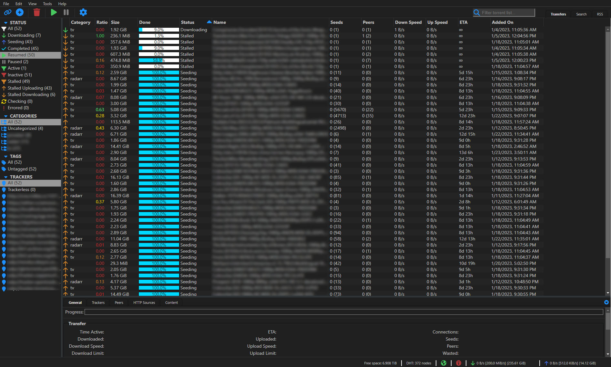

# qBittorrent Web UI theme - cjratliff.com [^1]
[^1]: Based on colorscheme from [cjratliff.com](https://cjratliff.com)



## Installation
First, you need to download a copy of the latest release (or clone / download this repository for the latest).

- [ ] Under Tools->Preferences->WebUI enable Use alternative WebUI.
- [ ] Choose a location that points to `/path/to/qbittorrent-webui-cjratliff.com`
- [ ] Restart qBittorrent or refresh your browser for changes to take effect.

You can also change these settings via the config file. The relevant entries are:

```
WebUI\AlternativeUIEnabled=true
WebUI\RootFolder=/path/to/qbittorrent-webui-cjratliff.com
```
